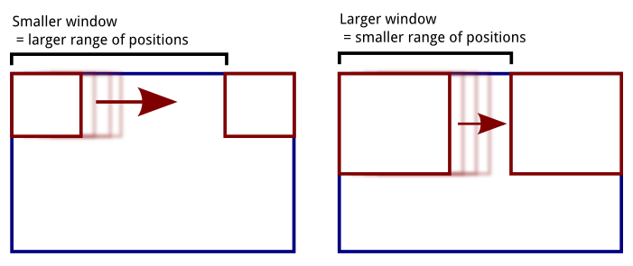
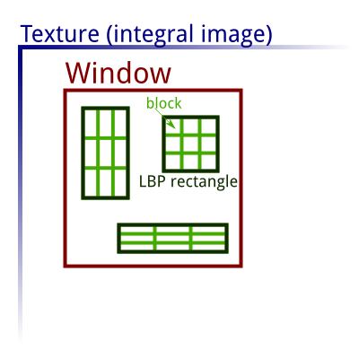
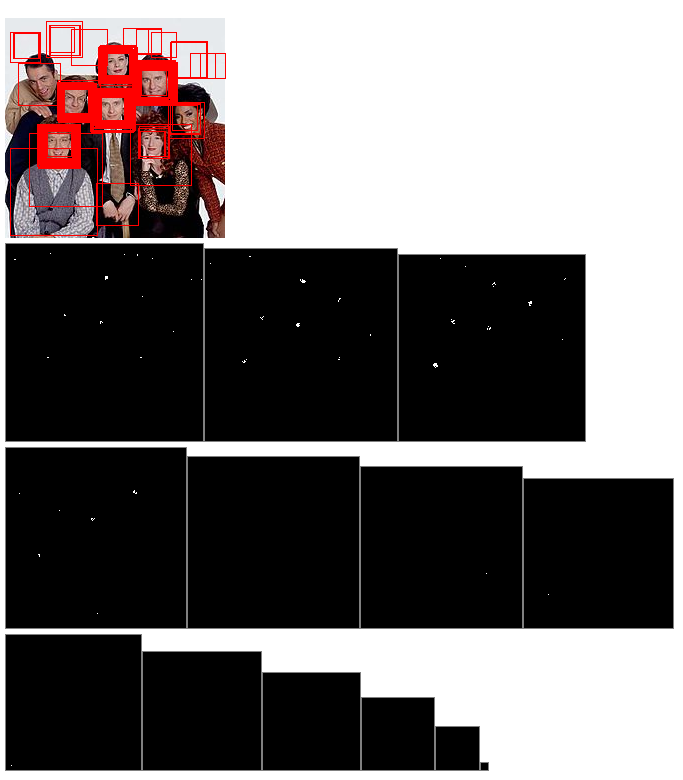
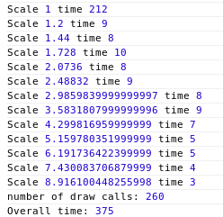
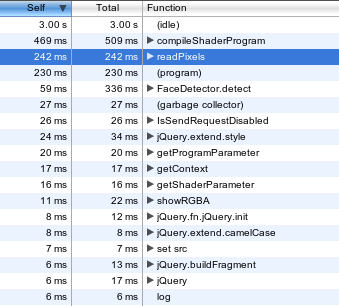
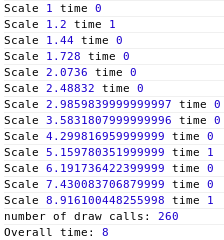
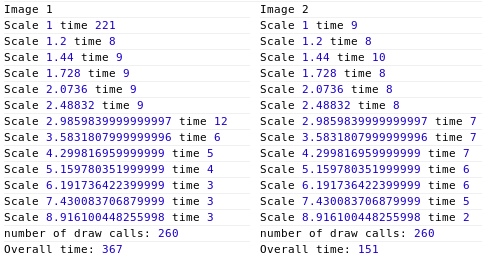
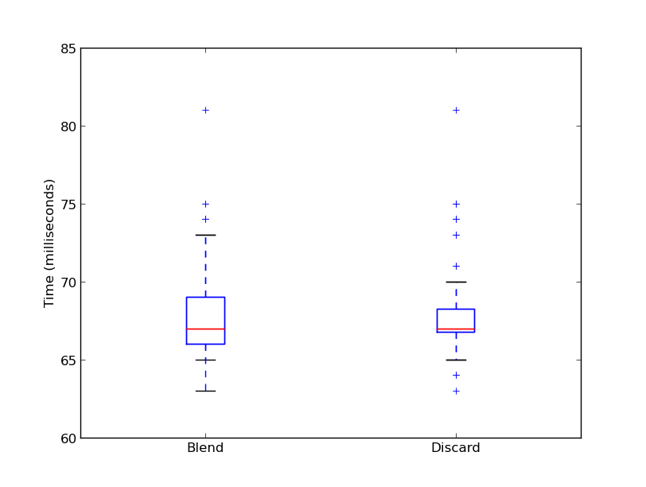
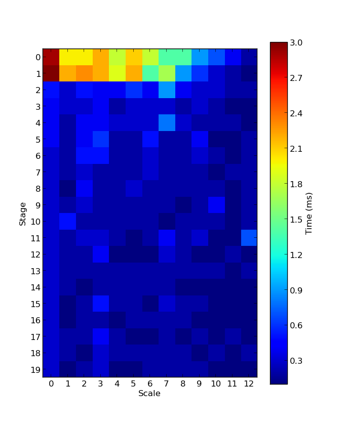
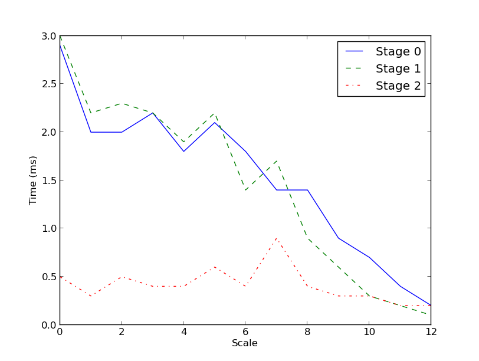

Coordinate Considerations
=========================

Working with the OpenGL ecosystem invariably requires an understanding of the
different coordinate systems used for the polygon vertices, textures and
screen. This becomes even more important when using OpenGL for computation, as
being off by one pixel (or a fraction of a pixel) can have much more serious
consequences than mere graphical glitches. If a texture is used as a lookup
table for arbitrary information, it is essential that the correct values are
indexed, to avoid giving, at best, completely incorrect results, or at worst
hard-to-detect bugs due to the limitations of floating point precision in the 0
to 1 range used to index textures.

Firstly we have the window (or screen) coordinates, which give the position in
the viewport, in other words the final image output. However, since the output
may be rendered to a texture, window coordinates don't have to be related to an
image actually displayed on the screen. They are similar to pixel positions,
however OpenGL itself does not have a concept of a pixel until rasterisation.
@Peers2002 gives a detailed mathematical treatment of OpenGL coordinates,
drawing from the OpenGL specification. In this way, the viewport can be treated
as a Cartesian plane whose origin and unit vectors are given by the
`gl.viewport(x,y,w,h)` command.  This sets the x,y offset of the origin, which is
at the bottom-left edge of the image, and determines the area of the scene
which should be rasterised, so in a graphics sense can be considered a sort of
cropping of the image. Two important points to note here are that the Y axis is
effectively flipped relative to the coordinate system usually used in graphics,
which has the origin at the top-left, and that integer coordinates will index
the bottom left corners of pixels, so to index the centre of a pixel requires
adding 0.5 to each dimension. For general purpose computation on a grid,
modifying the viewport can be used to change the output range of the
computation. For example, when doing face detection at different scales, the
"sliding window" of the detector will change size, meaning less pixel positions
need to be considered for larger windows, so the size of the output grid should
be smaller.



The vertex positions of polygons are specified by setting the `gl_Position`
variable in the vertex shader. This is a four dimensional `(x,y,z,w)` vector
where x,y,z are in Normalised Device Coordinates, a resolution-independent
coordinate system which varies from -1 to 1 in each dimension such that the
origin is at the centre. These then undergo perspective division by the fourth
`gl_Position.w` coordinate. For convenience we can use window coordinates when we
supply the vertices as an attribute, then compute the normalised coordinates in
the vertex shader by dividing by the image resolution. This will give a value
in the range [0,1], which can be changed to the range [-1,1] by multiplying by
2 then subtracting 1. For the purposes of computation on a 2D grid, the only
geometry we need is a rectangle aligned with the viewport, which we can get by
drawing two triangles. We do not want any perspective division, so z,w can be
set to 0,1. This effectively "passes through" the vertex coordinates, allowing
us to use them as if they were window coordinates.

The shader code to achieve this is: (where aPosition is the vertex position
attribute and uResolution gives the image resolution)

``` {.C}
vec2 normCoords = ((aPosition/uResolution) * 2.0) - 1.0;
gl_Position = vec4(normCoords, 0, 1);
```

Finally, we have to deal with the coordinates of texture maps, made up of texels
(the texture equivalent of a pixel) which are sampled using texture2D() in the
fragment shader. They have coordinates from 0,0 in the bottom left to 1,1 in the
top right. Textures may be sampled using different filtering methods in order to
interpolate between the discrete texels, the simplest being "NEAREST" which
simply uses the closest texel value, and "LINEAR" which interpolates linearly
based on the distance to surrounding texels. To sample at precisely the texel
centre, with no filtering, it is necessary to offset by half a texel, since the 
"zero" of a texel is at the bottom left corner.  So for the ith texel in a row
we would use X coordinate `(i + 0.5)/width` to offset then normalise to the \[0,1) range.


Initial Implementation
======================

The main strategy for the initial implementation of face detection in WebGL is
to offload the lookup operations on the integral image, the calculation of the
Local Binary Pattern values, and the subsequent window evaluation to the
fragment shader.  This allows the "sliding window" to be parallelised so that
we are evaluating multiple window positions at once. For each stage in the face
detection cascade we have to compute the Local Binary Pattern for various
rectangles within the window. Depending on which pattern we get for a
rectangle, it may either contribute a positive or a negative weighting towards
the window being a face. Summing the weights contributed by all the rectangles
and comparing against an overall threshold for the stage, we determine whether
the window should be rejected outright or subjected to further scrutiny in
later stages.  Computing each Local Binary Pattern rectangle requires 16
texture lookups, since we have to subdivide the rectangle into 3x3, giving 9
blocks, and compare the intensity of the centre block with the 8 surrounding
blocks. Using the integral image technique, finding the intensity of a block of
any area requires just four texture lookups, so for each rectangle we need to
sample 4x9 = 16 points.



The data on which Local Binary Patterns should be considered positive or
negative is accessed from the shader by using a grayscale texture as a lookup
table. There is one row for each stage in the cascade, so the height is the
number of stages, and for each LBP rectangle we have 256 possible patterns. A
black pixel is used to indicate a positive pattern, a white pixel a negative
pattern. The width of the texture is then 256 x the maximum number of
rectangles.  For the default cascade used, we have 20 stages and a maximum of
10 LBP rectangles, giving a $10\times2560$ texture. This differs from the more compact
representation used by OpenCV, which packs the data for one rectangle into 256
bits (8 32-bit ints) per rectangle but is necessary because the GL shader
language does not support the bitwise operations needed to extract the
individual bits (since numbers may in fact be implemented as floating point in
hardware), nor the range needed for 32-bit integers.

~~~~~ {.ditaa .no-separation}

 /------------------------------------------------------------------------\ 
 |cFC7                                                                    |
 |  Stage 1                                                               |
 |   o stageThreshold                                                     |
 |                                                                        |
 |    /------------\     /------------\     /------------\                |
 |    | Rectangle 1|     | Rectangle 2|     | Rectangle 3|                |
 |    +------------+     +------------+     +------------+                |
 |    | x          |     | x          |     | x          |                |
 |    | y          |     | y          |     | y          | ...            |
 |    | width      |     | width      |     | width      |                |
 |    | height     |     | height     |     | height     |                |
 |    | LBP vals   |     | LBP vals   |     | LBP vals   |                |
 |    \------+-----/     \------------/     \------------/                |
 |           |                                                            |
 |   Pattern ∈ LBP vals?                                                  |
 |     yes       no                                                       |
 |      |        |                                                        |
 |      |        |                                                        |
 |      v        v                                                        |
 |  positive   negative                                                   |
 |  weighting  weighting                                                  |
 |                                                                        |
 |                                                                        |
 \------------------------------------------------------------------------/
~~~~~

A shader program is compiled for each stage of the cascade, based on the same
shader source code but using compiler #defines to modify certain constants,
such as the number of rectangles.  This is because loop conditions in GLSL must
be based on constant expressions, so the number of rectangles to loop over
cannot be passed as variable. Each stage writes out a texture with a white
pixel for each window accepted, a black pixel otherwise. The texture from the
previous stage is used as an input to the next stage, to avoid computing
windows which have already been rejected.

On top of this loop over stages, we also need to consider different scales, to
be able to detect faces of different sizes in the image. This is done by
setting a scale factor, such as 1.2, which we successively multiply the window
size and rectangle offsets by. We run the detection for each scale, starting
from the base 24x24 pixel window size, until some maximum where the window
would be too big to fit in the image.

After detection is run on each scale, the accepted window texture is read back
to a JavaScript array using the WebGL `gl.readPixels` command, and used to draw
appropriately sized rectangles at the locations where faces have been found.



Achieving Higher Performance
============================

In order to test how fast this initial implementation is we can insert some
timer calls. We measure the time for each scale as well as the overall time for
the detection call (after the inital setup of shaders and textures), on an
image of dimensions 320x240 containing three faces of different scales.  This
gives the output shown below.



This gives an overall time of 375 milliseconds, obviously not good enough for
real time detection. Looking more closely, the majority of time seems to be
spent on the first scale, which takes 212 ms, whereas the other scales take
10ms or less.  Using the Chrome Javascript Profiler tool we can investigate
further by checking which functions are taking up the most time.



This shows that (besides the initial overhead of setting up the shaders) most
of the time is spent in the `gl.readPixels` function, responsible for
transferring image data from GPU memory back to JavaScript. An easy way to see
just how responsible this function is for the slowdown is to simply comment the
`readPixels` calls and associated code for drawing rectangles, which gives the following timings:



This shows a massive improvement, bringing the time down to 8ms, but obviously
our face detection is not very useful if we cannot actually get the locations
of the faces at the end!

The previous results were timed using a single image, running the detection
once after the page loads. In a real scenario we would want to be detecting
continually on each frame. This leads us to investigate the result of running
the detection on two different images, one after the other, without refreshing
the page. (In fact the same image, but flipped horizontally, so we would expect
similar face detection results, but avoid any clever caching by the
browser).



This gives the surprising result that, while the first run of the detection
takes a long time, the second is considerably shorter, with times between 2 and
10 ms for each scale. While we cannot determine the exact cause of this, it
seems that from a "cold start", readPixels has some overhead which is not
experienced on subsequent calls. So while readPixels is still the slowest
factor, once the detection gets going we need not worry about reads taking over
100ms. From here, the best strategy to improve overall time seems to be to
minimise the number of readPixels calls needed, ideally with just one at the
end of detection rather than intermediate calls for each scale.

While refactoring the code to "pingpong" by flipping between multiple
framebuffers, rather than the more expensive technique of using one framebuffer
and attaching different textures in turn (as recommended by @Tavares2011a at
37m20s), it was discovered that the slowdown on the first readPixels seemed to
disappear. However, after some work to narrow down the exact conditions which
would produce the slowdown, it was determined that this optimisation alone was
not responsible for the difference, but rather that it was determined by the
ordering of the calls to attach textures to the framebuffers, relative to the
code setting up the shaders. It turned out that, if at least one
`gl.framebufferTexture2D` call was before the shader setup, the initial
readPixels call took 10ms, whereas otherwise it took over 200ms. The initial setup
which includes compiling the shaders always takes around half a second, so while the order
of calls does not change the initial setup time, it allows the "warm up" time
required before readPixels to effectively be hidden behind the time needed to
compile the shaders. This is likely because the shader compilation is mostly
CPU-bound, allowing other tasks to be done in parallel on the GPU.

In order to eliminate the intermediate readPixel calls, we need to write the
output from each scale to the same texture, preserving the pixels output from
the previous scale, and encoding the scale in the pixel value. To indicate the
scale of an accepted window we can simply write out the ordinal number
(1,2,3...) of the scale as a colour value, or 0 if the window is rejected. The
size to multiply the rectangle by is then $scaleFactor^{(scaleNumber-1)}$. The
use of two textures to "pingpong" the results between each stage in a scale
remains as before, except that on the final stage we write to a shared final
output texture. One limitation is that, if we have two detections of different
scales at exactly the same position, the later (larger) scale will overwrite
the previous one. However, this should be a relatively rare occurence, and
should not make too much difference when all the rectangles are grouped to find
the final face positions. Another complication is that we want to keep the
previous written pixels, instead of writing a black pixel for a rejected window
in a subsequent scale. The simplest way to prevent output of any pixel at all
is to use the `discard;` statement in the fragment shader. However, in certain
cases (discussed in @discardperf) this may invoke a performance penalty,
particularly on mobile GPUs. An alternative is to use OpenGL's blend modes,
which specify how pixels written should be blended with the pixels already
present.


First an implementation was created using `discard;`, giving an average time of 71ms
per detection run (for a 320x240 image over 20 runs), compared to 110ms using
`readPixels` for each scale under equivalent conditions. 

The implementation was then adapted to use blending, in order to test which
would give the best performance. As explained in @Thomas8, the
`gl.blendFunc(sfactor, dfactor)` function sets the factors which the source
(being drawn) and destination (already in the framebuffer) should be multiplied
by, where `sfactor` and `dfactor` are symbolic constants determining where the
factors should come from. The output for each colour channel is given by
$Result = SourceVal \times SourceFactor + DestVal \times DestFactor$. We set
`sfactor` to `SRC_ALPHA` and `dfactor` to `ONE_MINUS_SRC_ALPHA`, which means that
when outputting `gl_FragColor` we can set the alpha value to 0.0 to completely
preserve the existing pixel.

Comparing the timing of the two techniques over 100 iterations, there turned
out to be almost no difference in the mean time, at least on a laptop Intel
GPU, although as shown in the box plot the Blend version had a slightly greater
variance. In the end the Blend version was preferred, to avoid potential
slowness with other GPUs and because it allowed the shader code to be
simplified, eliminating a branching condition to explicitly check if the window
was rejected.



<!--commit cce857eb3ef56be9aaf6d2df1e1cfe6665c74b9a -->

Timing stages
-------------

In order to analyse the times of operations at a finer granularity, we want to
time each draw call individually. However, because the CPU and GPU operate
asynchronously, each draw call will in fact return immediately, and the CPU
will only wait for the GPU to finish when some operation requiring information
from a framebuffer is performed. Therefore, we insert a dummy readPixels
operation, reading only 1 pixel, after each draw. Because some times are very
small (below 1ms) and difficult to measure accurately, we also artificially
repeat each draw operation 10 times, and divide the total time by 10. In this
way, we can obtain a detailed profile of how much time is spent running the
shader for each stage and scale.

We observe that, as expected more time is spent in the early stages, because
the first stage must run on all windows, whereas for laters stages some windows
are rejected. Increasing the scale also shows a decrease in time, since less
window positions need to be evaluated, although this is only really noticeable
in the first two stages, the subsequent stages showing around the same time
regardless of scale.






What is interesting to note is that the first three stages take up 48% of the
time, while the remaining 17 stages take up 52% of the time. So while it is
tempting to try to chip away at the above-2ms times in the early stages, we
have a "long tail" effect where the sub-0.5ms times of later stages add up to a
significant proportion of the overall time. Therefore, treating the early
stages as special cases (such as manually fine-tuning the shader code for these
specific stages) is unlikely to provide much of an advantage, compared to
general techniques that apply equally to the later stages.

Why are the shaders slow?
-------------------------

At an abstract level, all the fragment shaders are doing is

1. Looking up some values in the integral image and LBP lookup textures
2. Doing some maths to determine what value to output

Now, GPUs are typically very fast at carrying out floating point calculations,
so we wouldn't expect the "maths" portion to be overly challenging. @Harris
explains this using the concept of "arithmetic intensity", the ratio of
computation to bandwidth.

    arithmeticIntensity = operations/wordsTransferred

According to Harris, applications that benefit most from GPU acceleration are
those with high arithmetic intensity, where "The data communication required to
compute each element of the output is small and coherent". So ideally, the
amount of data fetched from textures would be small, and would be spatially
localised, in order to take advantage of caching. Unfortunately, in order to
calculate the 9 blocks of the rectangle for each classifier, we require 16
texture lookups, and the positions fetched for a window are not guaranteed to
be close together. Since the number of weak classifier rectangles can vary from
3 in the first stage to 10 in the later stages, we are talking about
$3 \times 16 = 48$ at best and $10 \times 16 = 160$ at worst texture
lookups. For the base scale they will at least be within the same $24 \times
24$ area, but when the window is scaled we will be fetching values locations
more spread out over the image. Texture caches are typically optimised for some
2D neighbourhood of a few texels, which great for
applications such as convolution where we just need to look up adjacent texels,
but is not ideal for more general purpose approaches.

To test the theory that the texture fetches are responsible for most of the
slowdown, we create a test shader which performs the same texture fetches as
our face detection shader but does not do anything useful with the result
(instead just outputting the sum of the values, to ensure the fetches are not
optimised out). Performing the same texture fetches as the 1st stage of the
cascade (48 fetches), and timing over 1000 iterations, we get an average time of 3.1 ms per
draw call, which is pretty much identical to the full shader. Further,
commenting out half the fetches reduces the time to 1.3ms, clearly showing
the impact of texture fetching on the time.

TODO: Things tried that made no difference:

* Moving code to calculate rectangle offsets into vertex shader
* Using UNSIGNED_BYTE texture (is faster if just reading one component (byte), but
  once we access all it is just as slow as FLOAT texture)
* Iterating over scales within the shader (just made the "multiscale" shader
  around as slow as the combined time for different scales, and makes it
  difficult to track which windows accepted, since we need to encode for each
  scale somehow)

Optimisations to look at:

* "Stage-parallel" processing - compute weak classifiers over a larger window
  at once, as in @Obukhov2011 - problem: Can only output four bytes for each
  fragment
* Split some work between CPU and GPU. Since the different scales can be
  computed independently, could hand off some portion of the scales to CPU to
  be processed simultaneously
  (but would then lose ability to use CPU for other tasks)
* Reduce number of texture accesses by "factorisation" of the LBP pattern - eg
  if we know the top left block should never be zero, can return negative from
  classifier after just computing centre and top left blocks. Problems:
  branching, and how to represent the "factoring" data in the shader (if it
  requires fetching more values from texture could do more harm than good!)
* z-Culling: use the depth buffer to indicate rejected windows, so that the
  fragment shader doesn't run at all for these pixels (in theory should offer
  some speedup by not running fragment shader at all on blocks of some size,
  and will avoid having to read the "activeWindows" texture, but
  doing the depth testing may have some penalty, and maybe the compiler is
  already clever enough)


Optimisation Techniques
=======================

The Perils of Branching
----------------------

Branching within the shader, while possible through the use of if-else
statements, carries with it numerous caveats, explained in @HarrisBuck. In the
"olden days" (say, 2003) in order to emulate branching, GPUs would simply
evaluate both sides of the condition, then determine which result to use before
writing the output. This meant that the time would be proportional to the
cumulative cost of both branches.

Things got better with the SIMD (Single Instruction, Multiple Data) model,
which uses multiprocessors executing the same instruction on many data elements
at once. In this case, the GPU will not be doing useless work evaluating both
sides of the condition, but instead divergent branches will cause a stall,
where the processors that do not take a branch have to wait for the branching
processors to catch up. In the worst case this will still take as long as both
branches combined, but in the case where all processors take the same branch
(known as coherency) it will be more efficient, and since the allocation of
fragments to processors is often done in a spacially localised manner, it
allows for speedups when fragments in the same area of an image branch in the
same way.

Finally, true dynamic branching may be available in the form of MIMD (Multiple
Instructions, Multiple Data) where different processors may execute different
instructions simultaneously. Most modern GPUs support dynamic branching to some
extent (NVIDIA's GeForce 6 series, released in 2005, introduced MIMD branching
in the fragment shader) however at an architectural level branching still
presents a barrier to efficient parallel computation, since knowing that all
fragments will follow the same instructions gives the GPU opportunities for
optimisation.

For this reason, branching in the shader should be kept to a minimum, and it is
preferred for algorithms to be structured such that fragments in the same
neighbourhood take the same branches in order to maximise coherency. Especially
in the case of WebGL, the programmer has no control over what graphics card
capability the user will have, and is unable to query information about the
graphics card due to security restrictions, so it is best to program for the
lowest common denominator.

TODO: Z-Culling

Bibliography
===========


