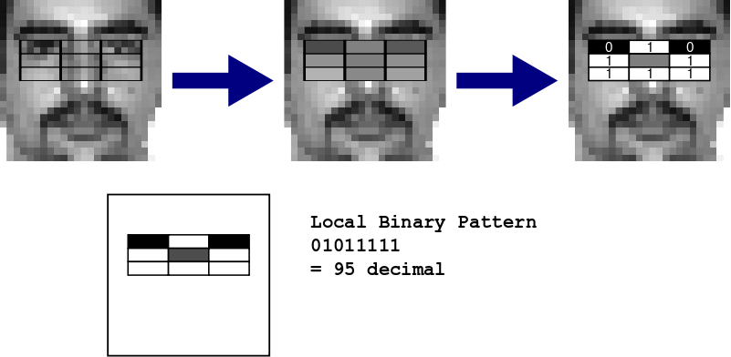

Background
==========

Face Detection
--------------

The seminal work on face detection is the @ViolaJones01 paper, which for the
first time gave reliable detection while maintaining a speed capable of real-
time use. These advances were due to a combination of different techniques.
Firstly, the use of the "integral image" in order to greatly reduce the number
of lookups to find the sum intensity of a region in an image, requiring only
four reads for an area of any size. An integral image is essentially a
cumulative map of the pixel intensities, such that the value at any position
tells the sum of those pixels to the top left of it (Figure \ref{integrals}).
By reading the four corners of a rectangle in an integral image, we can cancel
out the area to the top and left, leaving only the sum of the area inside the
rectangle (Figure \ref{integralcalc}). This makes it easy to compare the
relative intensities of areas in images, which is fundamental to the features
chosen by Viola and Jones, the Haar features (so named due to similarity with
Haar Wavelets). Haar features compare the difference in brightness between
regions of rectangles, in an attempt to pick up contrast variation. The
feature value is the white region minus the shaded region of the rectangles in
the figure. A $24\times24$ window is typically used for face detection, and
during detection the values of Haar features at specific positions and sizes
within that window (determined in the learning stage) need to be computed.


Accounting for all variations in position and size (x,y,w,h) within the window
there are many thousands of possible features. In order to pick a small number
that are good for classifying, the method of Boosting is used (specifically
AdaBoost), which allows multiple weak classifiers to be combined into one
strong classifier. A weight is associated with each training sample, initially
all equal, and the feature which best discriminates between the positive and
negative samples is chosen. The weights are then updated such that
missclassified samples using this feature are given a higher weight, and
correct samples a lower one (so more effort goes towards "fixing" the
missclassifications), then the feature selection is repeated with the new
weights. In the end we get an ensemble of features that combined have a lower
error.


![A visual illustration of Adaptive Boosting (AdaBoost), and the weight update
step [(@Thewlis12)] \label{adaboost}](./adaboost.png)

However, with the above, during detection all the chosen features will need to
be computed for all the window positions. Viola and Jones noticed that this
could be improved by having a cascade of different boosted classifiers, which
are decent at rejecting non-faces but will rarely reject a true face, chaining
these classifiers together such that a rejected window will be immediately
discarded, but an accepted window will be passed on to the next level in the
cascade to face further scrutiny. This means that normally only the windows
with true faces need go through every single level, whereas a non-face may be
rejected right from the start. This avoids examining every single chosen
feature for every single window, and makes sense intuitively since the vast
majority of windows in most images will not have a face, so it is beneficial
to reject them early, speeding up the procedure.


A widely used implementation of Viola Jones face detection is the OpenCV
library, which provides several pre-trained cascades in an XML serialisation
format. Many of the javascript face detection solutions are based on OpenCV's
code.

@LienhartMaydt02 propose an extra set of "tilted" Haar features at
45 degrees, computed thanks to a rotated integral image, in order to better
represent distinctive characteristics such as slanted edges which would
otherwise be missed.

Besides Haar features, another mechanism that can be used is Local Binary
Patterns (LBP). Originally used for pattern description by @Ojala, the
basic LBP simply describes the neighbourhood of a pixel in terms of whether
the 8 surrounding pixels are darker or lighter than the central one, and going
clockwise from the top, can be represented as an 8 bit number by writing 1 if
the center is lighter, 0 otherwise.

@Zhang extended LBP to a multi-block
representation, dividing a rectangle into 3x3 blocks and comparing the outer
ones with the centre, for use with face detection. Properties of LBP are that
it is more robust to illumination variation, since it only records the
lighter/darker relationship rather than a quantitative amount like with Haar.
The ability to represent the configuration of an LBP rectangle in just one
byte also makes it space efficient, especially useful when GPU textures are
involved, since one could pack four patterns in one "pixel".



OpenCV also includes an LBP face detection implementation, along with a pre-
trained XML file specifying a cascade for detecting frontal faces. It differs
from the Haar cascades in that, for each weak classifier in a stage, rather
than a simple threshold there is a list of the possible patterns (0 to 255)
that contribute either positively or negatively towards a candidate window
being a face, represented internally as a bit vector of size 256, made up of 8
32 bit integers.

[TODO explain LBP, advantage on GPU]

~~~~~ {.ditaa .no-separation}

 /------------------------------------------------------------------------\ 
 |cFC7                                                                    |
 |  Stage 1                                                               |
 |   o stageThreshold                                                     |
 |                                                                        |
 |    /------------\     /------------\     /------------\                |
 |    |Weak        |     |Weak        |     |Weak        |                |
 |    |classifier 1|     |classifier 2|     |classifier 3|                |
 |    +------------+     +------------+     +------------+                |
 |    | x          |     | x          |     | x          |                |
 |    | y          |     | y          |     | y          | ...            |
 |    | width      |     | width      |     | width      |                |
 |    | height     |     | height     |     | height     |                |
 |    | LBP vals   |     | LBP vals   |     | LBP vals   |                |
 |    \------+-----/     \------------/     \------------/                |
 |           |                                                            |
 |   Pattern in LBP vals?                                                 |
 |     yes       no                                                       |
 |      |        |                                                        |
 |      |        |                                                        |
 |      v        v                                                        |
 |  positive   negative                                                   |
 |  weighting  weighting                                                  |
 |                                                                        |
 |                                                                        |
 \------------------------------------------------------------------------/
~~~~~

Vision in the Browser
---------------------

The desire to integrate Computer Vision with the web has some history.
Existing approaches largely make use of custom browser plugins able to run
native code, such as the face detection used in Google Hangout
@GoogleAPI. This has the disadvantage of requiring the user to trust and
install the plugin in question, or may rely on browser-specific technology
such as Microsoft's ActiveX or Google's Native Client. Adobe Flash has proved
another contender @flashopencv, being a commonly installed plugin able
to provide access to the webcam, but its bytecode-based VM is slower than
native code, and its popularity is waning due to incompatible mobile devices
and the introduction of comparable features in the HTML5 specifications.

JavaScript, the de-facto language of the web, has been applied to certain
vision tasks with some success. Despite the disadvantage of being an
interpreted language, recent efforts towards speeding up JavaScript engines,
such as Google Chrome's V8, have led to great improvements through techniques
such as JIT ("Just In Time") compilation. Another leap forward in making
JavaScript suitable for Vision was the "getUserMedia" API, introduced in 2011,
giving JavaScript direct access to the user's webcam (upon consent). There are
existing implementations of single-image face detection in JavaScript, such as
@NSS, and there is the more amusing cat face detector @Kittydar. Face
detection on video is also possible, but typically employs techniques such as
downsizing the video or skipping frames. Upon embarking on the present
project, the author could locate no similar such endeavour to implement a
Vision suite in JavaScript, but fate being as it is, a similar project by the
name of "jsfeat" @jsfeat appeared on the scene within a couple of weeks. The
author chooses to take this as proof of current demand for vision on the web.
Since jsfeat does not include GPU acceleration, it will serve as a useful
baseline. In demonstrations on the web, when set to use the full range of scales, it can
detect faces at around 27 fps, although it is working on input images of
160x120 resolution, and then using a "step" so that it skips every other
pixel at the finest scale, and this step increases for larger scales.

The effort to give JavaScript standards-based access to computational and
graphical libraries that can take advantage of dedicated hardware was
pioneered by the Khronos group, maintainers of the OpenGL and OpenCL
specifications. These libraries are commonly used in native programs for 3D
graphics and parallel computation respectively.

In 2009 Khronos began to draft a specification for WebGL, which would give
JavaScript 3D drawing capabilities, through an extended context of the
"canvas" element which was introduced in version 5 of the HTML specification.
WebGL is based on the OpenGL ES 2.0 specification, which itself is a cut down
version of OpenGL initially designed for the benefit of mobile devices,
lacking OpenGL's deprecated fixed rendering pipeline (which has built in
support for lighting and perspective transforms) to give a more lightweight
library, leaving it to the developer to explicitly specify vertex
transformations and texture values needed to render a scene. WebGL's functions
and behaviour are largely identical to OpenGL ES 2.0, so resources and
documentation are often applicable to both. Some additional considerations are
needed for the browser-based host such as security restrictions on image
access and support for web-specific data types like HTMLVideoElement for
grabbing texture from a video (eg. from a webcam) on the page. The
specification for WebGL 1.0 was released in 2011 and experimental support is
present in the latest versions of Google Chrome and Mozilla Firefox. Safari
and Opera also support WebGL although it is currently disabled by default.
Microsoft's Internet Explorer does not support it, unless third party plugins
are used.

Following WebGL, work was started on a WebCL specification, providing
JavaScript bindings to the OpenCL parallel computation library, to allow code
to be sped up using hardware on the GPU or multi-core CPU, a use case being
physics calculations in games. Although it is still in draft form,
implementations have been released by Nokia and Samsung in the form of browser
plugins. WebCL would certainly be a strong candidate for Vision related tasks
in the browser, especially given the wide use of OpenCL and Nvidia's CUDA for
implementing high performance Vision systems. However, it is not yet
implemented natively in any browser, and it remains to be seen whether it will
be adopted by browser manufacturers. Since the goal of this project is to
implement Computer Vision in current browsers with no extra steps required on
behalf of the user, at the moment WebCL is unfortunately not an option, and
its cousin WebGL is the only viable choice for running code on the GPU from a
browser.

Despite being intended for drawing 3D graphics, OpenGL and hence WebGL is
quite capable for performing arbitrary calculations, due to the use of
shaders, which are programs that run on the GPU for the purpose of modifying
the geometry and colour of a scene. Using OpenGL for arbitrary computation
seems to have become quite fashionable around 2005, as evidenced by the number
of pages dedicated to it in the GPU Gems 2 book, but then seems to have fallen
out of favour after NVIDIA released CUDA in 2007, giving a more convenient
purpose-built framework for computation in the GPU. Nevertheless, with the
rise of OpenGL ES in smartphones and WebGL in the browser, using GL for
computation remains attractive. In OpenGL there are two types of shader,
vertex shaders, which specify the geometrical position in 3D given an array of
vertex points and vertex-specific attributes, and fragment shaders, which
specify the colour (RGB and alpha transparency) of the output pixels after
rasterisation. Shaders in OpenGL are written in GLSL (The OpenGL Shader
Language) a C-like language which offers many of the conveniences found in
computation-oriented GPU platforms such as CUDA. An advantage of handling
computation in shaders is that they operate in a parallel, computationally
independent manner on many vertices or pixels, essentially the SIMD (Single
Instruction Multiple Data) paradigm. This offers a large advantage over
sequential computation on the CPU, provided the algorithm can be structured in
such a way as to take advantage of massive parallelisation over many data
elements, as is often the case with image processing algorithms where a
certain operation is desired to be performed on every pixel. The fragment
shader is where the main potential for parallelisation over data lies, since
it can look up data in textures, run procedures, and output a value for every
pixel in the canvas. However, computation in the vertex shader can also be
valuable, since it precedes the fragment shader in the OpenGL pipeline and is
able to pass data to it in the form of "varyings", which are vertex-specific
variables then interpolated across the rasterised surface. This gives the
possibility to precalculate information in the vertex shader that will be used
by many pixels.


So far we have been talking about pixels and 3D vertices, which are not very
useful if we want to work with 2D images or arbitrary numerical data. The
trick to getting a simple 2D surface is to render a viewport-aligned rectangle
(in practice, by drawing two triangles). As @TavaresFundamentals describes, WebGL
is essentially a 2D API if we want it to be, and we can work in pixels rather
than OpenGL's "clipspace" units (which are -1.0 to 1.0) by normalising by the
canvas resolution. As for passing data to the shaders, a limited amount of
floating point or integer variables and arrays may be passed as "uniforms" to
the shaders (which remain constant for each vertex or pixel), but for handling
large data such as images and arrays textures must be used. Instead of drawing
to the screen, the output may be rendered to a framebuffer with a texture
attached, allowing it to be used as an input texture for another stage. Each
pixel in a normal texture is 4 bytes (RGBA), which is suitable for
representing some numerical data, but in many cases it is preferable to use
floating points. This can be done using the WebGL extension
`OES_texture_float`, which is supported on most platforms. However, until
recently, there was no defined way to read back floating point values to
JavaScript, requiring inventive solutions such as packing floats into bytes
@webgl-gpgpu. The latest draft specifications of
`EXT_color_buffer_half_float` @colorbufhalf and
`WEBGL_color_buffer_float` @colorbuf, amend the readPixels() function
to permit float types, however it will be a matter of time before all browsers
support it. In addition, when doing calculations, care should be given to the
precision qualifiers offered by GLSL (highp, mediump, lowp) which alter the
precision of numerical representations, at a speed/accuracy tradeoff. Per the
GLSL specification, highp (normally IEEE float) may not be available in the
fragment shader, and integers may be implemented as floats in the hardware,
which should be taken into account when implementing algorithms.

There are various examples on the web using WebGL to improve the efficiency of
calculations in simulations, such as WebGL Water @Wallace which
calculates the water and caustics simulation in the shaders,

In addition, the trick of using of OpenGL Shaders to increase performance is
employed by the GPUImage library @Larson for image processing on iOS
devices.

Computation in WebGL - concepts and example
--------------------------------------------

We shall provide a gentle introduction to the concepts behind using WebGL to
perform general purpose computation, walking the reader through the main steps
required to implement a simple convolution shader which operates on images
from the webcam. Although this is a somewhat simple image processing task, it
introduces many of the techniques that will be essential for face detection.
Indeed, the act of processing a stage of the face detection cascade within a
window can be viewed as a sort of glorified convolution, since for a certain
pixel location it consists of looking up the values within some surrounding
neighbourhood, using them to determine what result to output.

We lean on the work of @Tavares2011 in using WebGL for image processing, and
the explanations of the WebGL API by @Tavares and @ZhenyaoMo2012. We draw on
@Harris in order to explain computational concepts in terms of OpenGL, in
particular we make use of the analogies presented between CPU techniques and
their GPU counterparts. We shall also make reference to a JavaScript library,
called WebCV, created by the author for the purpose of abstracting away some
of the complications of WebGL, providing utility functions which facilitate
tasks commonly needed for general purpose computation and computer vision
applications.

Before we can start using WebGL, we must first make some preparations. WebGL
is exposed through a special context of the HTML `<canvas>` element, so we
insert a canvas in our document, specifying the width and height. To access
the webcam, we also require a `<video>` element, which we set to the same
dimensions as the canvas. The body of our HTML document then looks as follows.

~~~~ {.html}
<body>
<canvas id="glcanvas" width="400" height="300"></canvas>
<video id="webcamvideo" autoplay width="400" height="300"></video>
</body>
~~~~

We must now use JavaScript to give some life to these elements. We want to
initialise the WebGL context of our canvas, and make it so our video receives
input from the webcam. For the former we can instantiate our WebCV library
using `WebCV.create(canvas)`, passing in our canvas, which returns an object
(which we shall call `cv`) through which we can access our utility functions.
The bare WebGL API is also available through `cv.gl`. This level of
indirection allows us to instantiate multiple copies of WebCV on different
canvas elements, each with their own WebGL context. To receive video from the
webcam we use the browser's `getUserMedia` API, for which we have a wrapper
available in `cv.utils.getUserMedia` to abstract away from the browser-
specific differences. This will cause a prompt to appear to the user, asking
for permission to use their webcam, and call a specified function upon
success. Within this function we then set the `src` of the `<video>` element,
which causes it to start streaming video from the webcam.

~~~~ {.javascript}
// Get our canvas object
var canvas = document.getElementById("glcanvas");

// Initialise WebCV, which in turn initialises WebGL
// We make cv and gl global variables
cv = WebCV.create(canvas);
gl = cv.gl;

// Ask for the webcam
cv.utils.getUserMedia({video: true},
                       function(stream) {
                           var vid = document.getElementById("webcamvideo");
                           vid.src = stream;
                       }, 
                       function () { alert("Couldn't get webcam"); });
~~~~

We now look at the roles of shader programs in WebGL. We have two types of
shaders, the vertex shader and the fragment shader. If we were using WebGL to
draw 3D geometry, the vertex shader would answer the question "Where should my
vertices be placed?", by setting the value of `gl_Position`, and the fragment
shader would answer the question "What colour should my fragments (pixels) be?", by
setting `gl_FragColor`.

Recall we have three special types of variables in our shader programs.
Uniform variables can be treated like global variables. They can be set from
JavaScript, and are accessible from both the vertex and the fragment shader.
They are the most straightforward way of setting variables which we use in the
shader, and are used for values that do not vary according to the position in
the image. For example, to convolve the image with a $3 \times 3$ matrix as
the kernel, we would use a Uniform variable to hold the matrix, since we need
the same matrix for every pixel, but can change the matrix for different uses
of the shader program.

Attribute variables are used in the vertex shader for accessing vertex-
specific data. They are specified by uploading arrays to buffers on the GPU. A
primary use of attribute variables is to set the *vertex coordinates* used to
determine the position of vertices, and the *texture coordinates* which define
a mapping of vertices to positions within texture. Following
@TavaresFundamentals, to draw a rectangle in 2D we need to draw two view-
aligned triangles, as in Figure \ref{quad} (since the triangle is the only
polygon primitive available in OpenGL ES and WebGL). This gives six
coordinates for the vertices, each with two elements $(x,y)$, so we would have
to upload a buffer of 12 elements.


The analogy given by @Harris [p.502] for the *vertex coordinates* is that they
specify the *computational range*, by determining which pixels will be
generated. We typically only wish to draw a rectangle (2 triangles), for which
the task of the vertex shader is fairly simple, we just want to pass through
the vertex coordinates, as if we were drawing pixel positions directly. A
schematic of this simple vertex shader is shown in Figure \ref{vertexshader},
and it can be used whenever we just want to draw things in 2D and forget we
are dealing with a 3D graphics API. Its only job is to draw the 2D geometry
specified by our vertex coordinates, as if by orthogonal projection, and pass
our texture coordinates to the fragment shader. The details of the
normalisation of the input vertex coordinates in pixels to output vertex
positions have been omitted, and require some understanding with OpenGL's
coordinate systems, explained in [TODO appendix coordinates].

While the *vertex coordinates* represent the *computational range*, the
*texture coordinates* can be considered our *computational domain*. Texture
coordinates in WebGL are 2-element floating point vectors varying from 0.0 to
1.0 in each dimension, and similarly to the vertex coordinates are passed as
an attribute to the vertex shader using a buffer. However it is the fragment
shader which needs to access the texture, not the vertex shader. This is where
the third special type of variable, the varying, comes in to play. Varying
variables output from the vertex shader at each vertex are linearly
interpolated across the fragments between the vertices (this can be seen graphically in Figure \ref{texinterp}). So while we only
specify the texture coordinates at each vertex, by using varyings the texture
coordinates passed to the fragment shader can span the entire texture. In many
cases we will want the computational domain and range to be equal, in which
case we can use a texture the same size as our output drawbuffer. However
texture coordinates give us the flexibility to have a domain and range of
different sizes, for example we may do some data minification that consumes
two pixels in order to output a result. In the case that the domain and range
are equal (or the domain can be expressed as offsets of the fragment position),
we can avoid using texture coordinates through the use of the special
`gl_FragCoord` variable in the fragment shader, which contains the screen-
space position of the current fragment (already offset by 0.5 to give the
centre of the fragment). We can then divide this by the texture size to get a
0.0-1.0 texture coordinate. An alternative way to modify the computational
range is to use the `gl.viewport` and `gl.scissor` comands. The first modifies
the size of the viewport, and the second lets us specify a box such that only
the pixels within the box are written.


We now come to the main powerhouse in our inventory of WebGL tools, the
fragment shader itself. The fragment shader is useful because it runs for
every pixel (or fragment), thus making it amenable to parallel computation on
a grid, where the output at one pixel does not require any intermediate
information computed by its neighbours. The analogy with the CPU given by
@Harris is that fragment shader programs can be treated like the inner loops
when iterating over our elements. So while on the CPU to process the elements
of a grid we would have to loop over the X and Y indices, and have some core
processing in the middle, it is this core that would be well suited to the
fragment shader when converting code to run on the GPU. @Woolley extends this
analogy to explain that many of the performance considerations we would
typically have in mind when writing the inner loop of an algorithm on the CPU
are equally valid when considering the code in our fragment shader. Primarily,
we want to put as little code as possible in the fragment shader itself, and
pre-compute variables outside the fragment shader where possible, to avoid re-
calculating redundant values for every fragment. The expense of inner-loop
branching is likewise a pitfall on the GPU, even more so because it prevents
efficient instruction-level parallelisation by the GPU hardware. However, this
said, often the shader compiler in modern graphics drivers is clever enough to
optimise away apparent inefficiencies, and especially compared to JavaScript,
putting redundant computation in the fragment shader may be faster, so the
only real way to know is to profile and test.

For our convolution example, the fragment shader is where we do the main work,
shown in Figure \ref{fragmentshader}. We have our kernel to convolve with
passed in as a uniform $3\times3$ matrix (bearing in mind the OpenGL matrices
are column-major), and our texture coordinates passed from the vertex shader
give our centre texel. Convolving is then a matter of accessing the 9 texels
in the neighbourhood and computing a weighted average using the values from
the kernel, which is easiest to do with a couple of `for` loops. (We might
think it faster to unwrap these loops and specify the texture coordinates
offsets individually, but the compiler likely does this already.) We output
our weighted average by assigning it to `gl_FragColor`, which causes this
pixel colour to be output during rasterisation. We can observe the effect of
several convolution kernels in Figure \ref{convolution}, along with an
application for edge detection.


Convolution can be seen as a *gather* operation, since we are obtaining data
from nearby locations in our grid of pixels, looking up values in texture
memory. We prefer that our computations be structured as a gather, since
fragment shaders are well suited to gathering, but it is impossible to perform
*scattering*, which is when we write out to different locations in memory,
distributing values to other elements in the grid. The fragment processed can
only write to precisely one location. As described in @Buck, if we require a
scattering operation, the first step should be to see if it can be converted
into a gather. Techniques for dealing with scattering include adding a layer
of indirection, by outputting an address along with our output value, which
can then be processed by later passes to give a contiguous array.

Once we have the shaders set up, launching our computation is then just a
matter of drawing geometry with the `gl.drawArrays(gl.TRIANGLES, 0, 6)`
function, which will draw the six vertices of our triangles. To run in real
time using images from the webcam, we use the browser's
`requestAnimationFrame` to call our drawing code at appropriate intervals.
This relatively new function avoids the problems of JavaScript's `setInterval`
function, which can be used for executing a function periodically, but has no
knowledge of framerate, and will keep on running even when the window is not
visible, wasting resources. Nevertheless, for browsers that do not support
`requestAnimationFrame`, we offer a wrapper function that falls back to
`setInterval`. In order to make all our shaders available through
JavaScript, we have a Python script that constructs a JavaScript object
containing all the shader source code, and a function `cv.getNamedShader` which deals
with the task of compiling and linking our shader programs. We also provide
functions in our WebCV library to deal with setting uniforms, uploading
buffers, creating textures etc., allowing us to specify an associative array
containing the uniform or attribute names with values as native JavaScript
arrays or numbers, automatically dealing with the messy task of calling the
correct version of many related functions, such as `uniform1f(), uniform2f(),
... uniform4iv() etc` which set uniforms of different types and sizes.

By now we are able to show the results of the convolution in our canvas on the
screen, but we would also like to be able to use the results of previous
computations in subsequent stages. For example, we might like to chain
together multiple convolution passes. For this we use a framebuffer, which
allows us to render our output to a texture. A framebuffer itself is just a
lightweight structure, containing multiple attachment points, to which we
attach objects containing storage, that we can render into. The attachment
point used for storing the pixel colours drawn is `COLOR_ATTACHMENT0`, to
which we can attach a texture whose values can then be accessed in subsequent
fragment shaders. Another type of attachment is the `DEPTH_ATTACHMENT`, to
which we can attach a depthbuffer, which will turn out useful later. Because
we cannot read from the same texture that we are rendering to, if we want to
use a pipeline of shaders it is necessary to use the "ping-pong" technique,
alternating between two different framebuffers, such that one is used as the
render target and one has its texture read by the shader, then swapping roles
so that the output from the previous pass can be fed into the next one.
Lastly, if we want to read back data into JavaScript, we can use the
`gl.readPixels` command, which copies the contents of the current
framebuffer's texture into a JavaScript array. Because this can be slow, it is
best to do all computation possible on the GPU before reading back at the end.


Implementation
==============

Cascade
-------

### Javascript Implementation

The core of the face detection method used is the cascade structure described
in [TODO], which subjects each window to progressively harder tests, each test
being a stage in the cascade which specifies a number of weak classifiers with
corresponding Local Binary Pattern features within the window.

Although the precise nature of these weak classifiers is crucial when
constructing a cascade from training images (using the statistical method of
Boosting to construct a strong classifier from individual classifiers
performing only slightly better than chance) for the purposes of detection we
need not be overly concerned with this. From a more abstract point of view,
the weak classifiers simply tell us which points we need to look up in the
integral image and which values should be used in the subsequent arithmetic in
order to determine whether a window passes a stage. The main challenge then is
to do this as fast as possible.

We initially implement the cascade using only JavaScript, running on the CPU,
to give us a reference implementation which can then be used to assess the
correctness of a WebGL version running on the GPU. For the moment we only
consider the base scale of the cascade, $24\times24$ pixels, meaning we can
only detect faces which occupy a window of these dimensions. We use the XML
cascade file `lbpcascade_frontalface.xml` from the @OpenCV project, however we
first use a Python script to convert this to a format more suitable for use
with JavaScript, JSON (JavaScript Object Notation) which allows us to treat
the cascade as a native JavaScript data structure, made up of JavaScript
objects (associative maps with string keys, of the form `{"key": value}`) and
arrays (eg. `[v1,v2,v3]` where values can be any type, not necessarily
homogenous). An example of this data structure is given below, showing just
one stage with one of its weak classifiers

\pagebreak

~~~~ {.javascript}

var lbpcascade_frontalface = {
    "width": 24, 
    "height": 24, 
    "stages": [
        // 1st Stage
        {
            "stageThreshold": -0.7520892024040222,
            "weakClassifiers": [
                // 1st Weak classifier
                {
                    "featureRectangle": [6, 5, 4, 3],
                    "leafValues": [-0.654321014881134, 0.8888888955116272], 
                    "categoryBitVector": [
                        -67130709, 
                        -21569, 
                        -1426120013, 
                        -1275125205, 
                        -21585, 
                        -16385, 
                        587145899, 
                        -24005
                    ]
                }
                // ...2 more weak classifiers in this stage
            ]
        },
    // ...19 more stages (having up to 10 weak classifiers each)
    ]
}

~~~~

Essentially, we have an array of stages, where each stage has a
`stageThreshold` and its own array of `weakClassifiers`. The elements of each
weak classifier merit further explanation:

* `featureRectangle`: Gives the position and dimensions of the weak
classifier's Local Binary Pattern feature as a tuple $(x,y,width,height)$. The
$(x,y)$ coordinates give the top left corner of the feature, and the width and
height are those of a single block of the feature, as shown in Figure
\ref{featureRectangleDia}.

~~~~ {.ditaa .no-separation .no-shadows .scale:0.8 "Interpretation of `featureRectangle` values \label{featureRectangleDia}"}
Window
*-----------------------------+
|(0,0)    width               |
|         <--->               |
|        *-----+-----+-----+  | 
|      ^ |(x,y)|     |     |  | 
|height| |     |     |     |  | 
|      v |     |     |     |  | 
|        +-----+-----+-----+  | 
|        |     |     |     |  | 
|        |     |     |     |  | 
|        |     |     |     |  | 
|        +-----+-----+-----+  | 
|        |     |     |     |  | 
|        |     |     |     |  | 
|        |     |     |     |  | 
|        +-----+-----+-----+  | 
|        Local Binary Pattern |
|                             |
|                             |
+-----------------------------+      

~~~~


* `leafValues`: The contribution of the weak classifier to the stage total in
the case that it evaluates as negative (first value) or positive (second
value). The stage total is the sum of these results for all its weak
classifiers, and a stage passes if this total exceeds `stageThreshold`.

* `categoryBitVector`: Perhaps the most cryptic of the elements, this is a
compact representation of which of the 256 possible Local Binary Patterns
should be considered a positive result for the weak classifier, and which
should be negative. It should be interpreted as eight 32-bit signed integers,
giving 256 bits overall. This gives us a bit vector, where the $i^{th}$ bit
(counting from 0) is 1 if pattern $i$ is negative and 0 if it is positive
(using OpenCV's somewhat counterintuitive convention). For example, pattern
$10101010_{bin}$ (which would represent alternating lighter and darker blocks
than the centre) is 170 in decimal, and if this pattern were indicative of a
face, then the $170^{th}$ bit in the bit vector would be 0. To check if bit
$i$ is zero or one, we can use the bitwise formula:
\newline `bitvec[i >> 5] & (1 << (i & 31))`
\newline
which will be non-zero if bit $i$ is set. This uses a right
shift by 5 to select the three highest bits of $i$ as an index to one of the 8
integers, then ANDs this integer with a number whose $j^{th}$ bit (only) is 1,
hence being non-zero if bit $j$ of the integer is set. $j$ is the lowest 5
bits of $i$ and is obtained by masking $i$ with 31 ($11111_{bin}$), and then
to get a number whose $j^{th}$ bit is 1 we left shift 1 by $j$.

This representation of the weak classifiers is in fact a simplification over
that used in the original OpenCV XML file, which uses a rather vaguely named
`<internalNodes>` element containing, in order, two dummy pointers to child
nodes (unused, since we are dealing with a stump based classifier, containing
only two leaf nodes, rather than a tree), the index of the feature rectangle
(number 46 in example below) which is used to look up the actual rectangle specified
elsewhere in the XML file, and then the eight elements of the bit vector.

~~~~ {.xml}
    <weakClassifiers>
      <!-- tree 0 -->
      <_>
        <internalNodes>
          0 -1 46 -67130709 -21569 -1426120013 -1275125205 -21585
          -16385 587145899 -24005</internalNodes>
        <leafValues>
          -0.6543210148811340 0.8888888955116272</leafValues></_>
      ...
~~~~

Given this specification of the weak classifiers, we now look at how to
compute the corresponding Local Binary Pattern values. From the
`featureRectangle` associated with each weak classifier we can find the
position of the blocks of our Local Binary Pattern within the window. In order
to compute the Local Binary Pattern value we need to know the total intensity
of each of these blocks (ie, the sum of all the grayscale 0-255 pixel values).
By using the integral image, we can find the intensity of a block of any area
with just four integral image values, those at the corners. We have nine
blocks in a pattern, but some share corners, so we require 16 points in total,
shown in Figure \ref{LBPlookup}.

~~~~ {.ditaa .no-separation .no-shadows .scale:0.8 "Points looked up for LBP (p0-15) and regions whose intensity we require (r0-7 and c) \label{LBPlookup}"}
Window
+--------------------------------+
|                                |
|        p0-----p1-----p4-----p5 | 
|        |      |      |      |  | 
|        |  r0  |   r1 |   r2 |  | 
|        |      |      |      |  | 
|        p3-----p2-----p7-----p6 | 
|        |      |      |      |  | 
|        |  r7  |   c  |   r3 |  | 
|        |      |      |      |  | 
|       p12----p13-----p8-----p9 | 
|        |      |      |      |  | 
|        |  r6  |   r5 |   r4 |  | 
|        |      |      |      |  | 
|       p15----p14----p11----p10 | 
|        Local Binary Pattern    |
|                                |
|                                |
+--------------------------------+      

~~~~

Computing the total intensities is then just a matter of using the integral
image trick described in [TODO], which takes advantage of the fact that the
value of the integral image at each point is the sum of all pixels to the top-
left of it in the original image. For example, for the centre and first block
we have:

~~~~
c = p8 - p6 - p13 + p3;
r0 = p3 - p2 - p1 + p0;
~~~~

Then, to find the value of our Local Binary Pattern as an 8-bit number, we must ask whether the value of r0 through to r7 is greater than the centre value c. If we define bit $b_i$ as the result of the expression $r_i \geq c$ (where true=1, false=0) then our binary value will be $b_0b_1b_2b_3b_4b_5b_6b_7$, which can be computed in JavaScript using bitwise shifts and sums.

With this JavaScript implementation of the cascade we can now observe
graphically the effect of each stage, by drawing masks of which windows are
accepted or rejected, plotting a white or black pixel respectively at the top-
left position of each window. This lets us see the early termination effect
which the cascade provides, whereby only a small number of windows pass
through to the end, saving computational effort. We can also plot the 0-255
values of the Local Binary Patterns, giving a visualisation of their
distribution over the image.

[TODO lbp and mask images, speed]

### Adapting to WebGL

Having completed a reference implementation in JavaScript, it is now time to
consider how best to take advantage of the capabilities of WebGL in order to
speed things up. We have seen [TODO] how WebGL can be used for computation on
a grid, and this method adapts itself quite naturally to our need to compute
many windows, whose results are independent of each other.

The main strategy for the initial implementation of face detection in WebGL is
to offload the computation of each stage, involving the lookup operations on
the integral image, the calculation of the Local Binary Pattern values, and
the subsequent window evaluation (our "inner loop") to the fragment shader.
This allows the "sliding window" to be parallelised so that we are evaluating
multiple window positions at once. We can consider our window to be "anchored"
to the fragment position in the top left (Figure \ref{lbpwindow})


Since the classification of a window requires the evaluation of a number of
stages, one choice we must make is whether to evaluate all these stages at
once, looping over each stage within the fragment shader, which would require
a single shader program able to handle every stage, or whether we should break
up the evaluation into a different draw call per stage, keeping track of which
windows have passed the previous stages using a texture.

Although having a single monolithic shader would avoid the overhead of a
separate draw call for each stage, there are reasons not to prefer this
approach. Firstly, we are limited in the amount of Uniform variables we can
transfer to the shader. According to @webglstats 81% of users have a
maximum of 221 Uniform 4-component variables available in the fragment shader,
although for 9% of users it is as low as 29. (These limits, which can be
queried at runtime, give the number of vectors of 4 floats which can be used.
Quite how this corresponds to limits on other types and arrays does not seem
to be documented, but they would be expected to share the same registers so be
similarly limited, and there is some (desktop OpenGL) discussion in @glsllist)
At 20 stages, each having up to 10 rectangles, we would struggle with these
limits. We could resort to packing the data into textures, however another
limitation is that loop conditions and array sizes in GLSL must be based on
constant expressions, available at compile time. Since each stage has a
different number of weak classifiers, we would want to loop over a different
number at each stage. We could solve this with a branch or `break;` within the
loop, however branching carries with it performance penalties. [TODO branching
appendix]

By instead having a shader program for each stage, we can use the same source
code for each stage, but inject compiler `#define`s specifying certain
constants, such as the stage number and the number of weak classifiers in the
stage, allowing us to use constant expressions for loop conditions. We can
then also make use of preprocessor directives so that different code is
compiled for different stages. Since GLSL has no array literals, we still need
to upload the arrays of `leafValues` and `featureRectangles` as Uniform
arrays, but because their size will be determined by the number of weak
classifiers in a single stage (maximum 10), we avoid pushing the limits of
Uniforms allowed. One disadvantage of having many shaders is that we must
compile them all, which gives a small delay upon initialising the face
detector (around a second for the 20 stages), however this is a one-time cost
upon startup so not too important for most applications.

Each stage writes out a texture with a white pixel for each window accepted, a
black pixel otherwise. The texture from the previous stage is used as an input
to the next stage, using the framebuffer "ping pong" technique, to avoid
computing windows which have already been rejected. An additional advantage of
splitting the computation into multiple draw calls is that we can inspect
these intermediate textures in order to debug our code.

The tasks we must do in our fragment shader are:

1. Check if the window has been rejected

2. Compute the Local Binary Pattern value for the various weak classifiers within the window 

3. Depending on which pattern we get, determine if we have a positive
  or a negative weighting towards the window being a face

4. Sum the weights contributed by all the classifiers, and compare against an overall threshold
  for the stage

5. Write out whether the window passes as the fragment colour

Some of these tasks are straightforward, however one complication is that we
have no bitwise operators in the fragment shader (since GPUs typically work
using floating point hardware for all numbers, what we might like to think of
as a bit pattern has no relation to the value stored in memory). This means
that we cannot compute the Local Binary Pattern value (a byte where each bit
indicates if an outer block is greater than the centre) in the natural way.
However we can get around this by forgetting about bits and thinking purely
arithmetically, in powers of two, which gives us the following formula.

~~~~ {.C}

lbp = (int(r0 >= c) * 128)
      + (int(r1 >= c) * 64)
      + (int(r2 >= c) * 32)
      + (int(r3 >= c) * 16)
      + (int(r4 >= c) * 8)
      + (int(r5 >= c) * 4);

~~~~

The lack of bitwise operators also means we cannot use a bitvector to specify
which Local Binary Patterns should be considered positive or negative.
Instead, this data is accessed from the shader by using a grayscale texture as
a lookup table (Figure \ref{lbpmap}). There is one row for each stage in the
cascade, so the height is the number of stages, and for each LBP rectangle we
have 256 possible patterns. A black pixel is used to indicate a positive
pattern, a white pixel a negative pattern (OpenCV's strange convention). The
width of the texture is then 256 $\times$ the maximum number of weak
classifiers.  For the default cascade used, we have 20 stages and a maximum of
10 LBP rectangles, giving a $2560\times20$ texture. This differs from the more
compact representation used by the OpenCV and JavaScript implementation which
packs the data for one rectangle into 256 bits (8 32-bit ints) per rectangle,
since we use up an entire byte for each possible pattern, but the texture only
needs to be uploaded to the GPU once and is fairly cheap to lookup.

Figure \ref{stagefrag} gives an overview of the main components of our shader
so far, labelled with the five tasks above.


Scaling
--------

On top of this loop over stages, we also need to consider different scales, to
be able to detect faces of different sizes in the image. There are two
potential ways to implement scaling of our classifier. The most obvious way is
simply to rescale our image, and this is the approach used by OpenCV. However
this would be expensive since it requires recomputation of the integral image,
which is done in JavaScript, so we would have to upload many images to the
GPU. The second way is to scale the classifier itself. This is done by setting
a scaling factor (we use 1.2) which we successively multiply the window size
and rectangle offsets by. We run the detection for each scale, starting from
the base 24x24 pixel window size, until some maximum where the window would be
too big to fit in the image. However one problem with this approach, mentioned
by @Obukhov2011, is that when we are not scaling by an integer amount, our
features are no longer aligned with pixel locations. The rounded coordinates
mean that the areas fetched using the integral image no longer correspond with
those specified by the features, which can give inaccurate results. It is
possible to re-weight the features to fit the scale, however for our purposes
we will simply live with the slightly inaccurate values.

After detection is run on each scale, the accepted window texture is read back
to a JavaScript array using the WebGL `gl.readPixels` command, and used to draw
appropriately sized rectangles at the locations where faces have been found.


Optimising
----------

### Achieving Higher Performance

In order to test how fast this initial implementation is we can insert some
timer calls. We measure the time for each scale as well as the overall time for
the detection call (after the inital setup of shaders and textures), on an
image of dimensions 320x240 containing three faces of different scales.  This
gives the output shown below.


This gives an overall time of 375 milliseconds, obviously not good enough for
real time detection. Looking more closely, the majority of time seems to be
spent on the first scale, which takes 212 ms, whereas the other scales take
10ms or less.  Using the Chrome Javascript Profiler tool we can investigate
further by checking which functions are taking up the most time.


This shows that (besides the initial overhead of setting up the shaders) most
of the time is spent in the `gl.readPixels` function, responsible for
transferring image data from GPU memory back to JavaScript. An easy way to see
just how responsible this function is for the slowdown is to simply comment the
`readPixels` calls and associated code for drawing rectangles, which gives the following timings:


This shows a massive improvement, bringing the time down to 8ms, but obviously
our face detection is not very useful if we cannot actually get the locations
of the faces at the end!

The previous results were timed using a single image, running the detection
once after the page loads. In a real scenario we would want to be detecting
continually on each frame. This leads us to investigate the result of running
the detection on two different images, one after the other, without refreshing
the page. (In fact the same image, but flipped horizontally, so we would expect
similar face detection results, but avoid any clever caching by the
browser).


This gives the surprising result that, while the first run of the detection
takes a long time, the second is considerably shorter, with times between 2 and
10 ms for each scale. While we cannot determine the exact cause of this, it
seems that from a "cold start", readPixels has some overhead which is not
experienced on subsequent calls. So while readPixels is still the slowest
factor, once the detection gets going we need not worry about reads taking over
100ms. From here, the best strategy to improve overall time seems to be to
minimise the number of readPixels calls needed, ideally with just one at the
end of detection rather than intermediate calls for each scale.

While refactoring the code to "pingpong" by flipping between multiple
framebuffers, rather than the more expensive technique of using one framebuffer
and attaching different textures in turn (as recommended by @Tavares2011a at
37m20s), it was discovered that the slowdown on the first readPixels seemed to
disappear. However, after some work to narrow down the exact conditions which
would produce the slowdown, it was determined that this optimisation alone was
not responsible for the difference, but rather that it was determined by the
ordering of the calls to attach textures to the framebuffers, relative to the
code setting up the shaders. It turned out that, if at least one
`gl.framebufferTexture2D` call was before the shader setup, the initial
readPixels call took 10ms, whereas otherwise it took over 200ms. The initial setup
which includes compiling the shaders always takes around half a second, so while the order
of calls does not change the initial setup time, it allows the "warm up" time
required before readPixels to effectively be hidden behind the time needed to
compile the shaders. This is likely because the shader compilation is mostly
CPU-bound, allowing other tasks to be done in parallel on the GPU.

In order to eliminate the intermediate readPixel calls, we need to write the
output from each scale to the same texture, preserving the pixels output from
the previous scale, and encoding the scale in the pixel value. To indicate the
scale of an accepted window we can simply write out the ordinal number
(1,2,3...) of the scale as a colour value, or 0 if the window is rejected. The
size to multiply the rectangle by is then $scaleFactor^{(scaleNumber-1)}$. The
use of two textures to "pingpong" the results between each stage in a scale
remains as before, except that on the final stage we write to a shared final
output texture. One limitation is that, if we have two detections of different
scales at exactly the same position, the later (larger) scale will overwrite
the previous one. However, this should be a relatively rare occurence, and
should not make too much difference when all the rectangles are grouped to find
the final face positions. Another complication is that we want to keep the
previous written pixels, instead of writing a black pixel for a rejected window
in a subsequent scale. The simplest way to prevent output of any pixel at all
is to use the `discard;` statement in the fragment shader. However, in certain
cases (discussed in @discardperf) this may invoke a performance penalty,
particularly on mobile GPUs. An alternative is to use OpenGL's blend modes,
which specify how pixels written should be blended with the pixels already
present.


First an implementation was created using `discard;`, giving an average time of 71ms
per detection run (for a 320x240 image over 20 runs), compared to 110ms using
`readPixels` for each scale under equivalent conditions. 

The implementation was then adapted to use blending, in order to test which
would give the best performance. As explained in @Thomas8, the
`gl.blendFunc(sfactor, dfactor)` function sets the factors which the source
(being drawn) and destination (already in the framebuffer) should be multiplied
by, where `sfactor` and `dfactor` are symbolic constants determining where the
factors should come from. The output for each colour channel is given by
$Result = SourceVal \times SourceFactor + DestVal \times DestFactor$. We set
`sfactor` to `SRC_ALPHA` and `dfactor` to `ONE_MINUS_SRC_ALPHA`, which means that
when outputting `gl_FragColor` we can set the alpha value to 0.0 to completely
preserve the existing pixel.

Comparing the timing of the two techniques over 100 iterations, there turned
out to be almost no difference in the mean time, at least on a laptop Intel
GPU, although as shown in the box plot the Blend version had a slightly greater
variance. In the end the Blend version was preferred, to avoid potential
slowness with other GPUs and because it allowed the shader code to be
simplified, eliminating a branching condition to explicitly check if the window
was rejected.


<!--commit cce857eb3ef56be9aaf6d2df1e1cfe6665c74b9a -->

### Timing stages

In order to analyse the times of operations at a finer granularity, we want to
time each draw call individually. However, because the CPU and GPU operate
asynchronously, each draw call will in fact return immediately, and the CPU
will only wait for the GPU to finish when some operation requiring information
from a framebuffer is performed. Therefore, we insert a dummy readPixels
operation, reading only 1 pixel, after each draw. Because some times are very
small (below 1ms) and difficult to measure accurately, we also artificially
repeat each draw operation 10 times, and divide the total time by 10. In this
way, we can obtain a detailed profile of how much time is spent running the
shader for each stage and scale.

We observe that, as expected more time is spent in the early stages, because
the first stage must run on all windows, whereas for laters stages some windows
are rejected. Increasing the scale also shows a decrease in time, since less
window positions need to be evaluated, although this is only really noticeable
in the first two stages, the subsequent stages showing around the same time
regardless of scale.


What is interesting to note is that the first three stages take up 48% of the
time, while the remaining 17 stages take up 52% of the time. So while it is
tempting to try to chip away at the above-2ms times in the early stages, we
have a "long tail" effect where the sub-0.5ms times of later stages add up to a
significant proportion of the overall time. Therefore, treating the early
stages as special cases (such as manually fine-tuning the shader code for these
specific stages) is unlikely to provide much of an advantage, compared to
general techniques that apply equally to the later stages.

### Why are the shaders slow?

At an abstract level, all the fragment shaders are doing is

1. Looking up some values in the integral image and LBP lookup textures
2. Doing some maths to determine what value to output

Now, GPUs are typically very fast at carrying out floating point calculations,
so we wouldn't expect the "maths" portion to be overly challenging. @Harris
explains this using the concept of "arithmetic intensity", the ratio of
computation to bandwidth.

    arithmeticIntensity = operations/wordsTransferred

According to Harris, applications that benefit most from GPU acceleration are
those with high arithmetic intensity, where "The data communication required to
compute each element of the output is small and coherent". So ideally, the
amount of data fetched from textures would be small, and would be spatially
localised, in order to take advantage of caching. Unfortunately, in order to
calculate the 9 blocks of the rectangle for each classifier, we require 16
texture lookups, and the positions fetched for a window are not guaranteed to
be close together. Since the number of weak classifier rectangles can vary from
3 in the first stage to 10 in the later stages, we are talking about
$3 \times 16 = 48$ at best and $10 \times 16 = 160$ at worst texture
lookups. For the base scale they will at least be within the same $24 \times
24$ area, but when the window is scaled we will be fetching values locations
more spread out over the image. Texture caches are typically optimised for some
2D neighbourhood of a few texels, which great for
applications such as convolution where we just need to look up adjacent texels,
but is not ideal for more general purpose approaches.

To test the theory that the texture fetches are responsible for most of the
slowdown, we create a test shader which performs the same texture fetches as
our face detection shader but does not do anything useful with the result
(instead just outputting the sum of the values, to ensure the fetches are not
optimised out). Performing the same texture fetches as the 1st stage of the
cascade (48 fetches), and timing over 1000 iterations, we get an average time of 3.1 ms per
draw call, which is pretty much identical to the full shader. Further,
commenting out half the fetches reduces the time to 1.3ms, clearly showing
the impact of texture fetching on the time.

TODO: Things tried that made no difference:

* Moving code to calculate rectangle offsets into vertex shader
* Using UNSIGNED_BYTE texture (is faster if just reading one component (byte), but
  once we access all it is just as slow as FLOAT texture)
* Iterating over scales within the shader (just made the "multiscale" shader
  around as slow as the combined time for different scales, and makes it
  difficult to track which windows accepted, since we need to encode for each
  scale somehow)


### Z-Culling

z-Culling: use the depth buffer to indicate rejected windows, so that the
fragment shader doesn't run at all for these pixels. This offers some speedup
by not running fragment shader at all on blocks of some size, and will avoid
having to read the "activeWindows" texture.

~~~~ {.ditaa .no-separation .no-shadows .scale:0.8}

We start with a depth buffer that is cleared to 1, the far value, meaning that
all pixels on our quad (which is at the near z value, 0) will be processed.

Depth buffer

+----+----+----+----+
|1   |1   |1   |1   |
|    |    |    |    |
+----+----+----+----+
|1   |1   |1   |1   |
|    |    |    |    |
+----+----+----+----+
|1   |1   |1   |1   |
|    |    |    |    |
+----+----+----+----+

~~~~


~~~~ {.ditaa .no-separation .no-shadows}

We then run the first stage, which will discard the output if the window is
accepted, writing a 0 if it is rejected. This causes the depth buffer to be
updated to the z value of the quad, 0, for those windows which have been
rejected, whereas the previous depth of 1 is preserved for the accepted
windows, since their output is discarded.

1st Stage Output          Updated depth buffer     
d = discarded    
1 = rejected                          
+----+----+----+----+     +----+----+----+----+  
|d   |0   |d   |0   |     |1   |0   |1   |0   |  
|    |    |    |    |     |    |cBLU|    |cBLU|  
+----+----+----+----+     +----+----+----+----+  
|0   |d   |d   |0   |     |0   |1   |1   |0   |  
|    |    |    |    |     |cBLU|    |    |cBLU|  
+----+----+----+----+     +----+----+----+----+  
|0   |0   |d   |0   |     |1   |1   |0   |1   |  
|    |    |    |    |     |    |    |cBLU|    |  
+----+----+----+----+     +----+----+----+----+  

On subsequent stages, those pixels with a depth value of 0 will not be
processed, since we are using the "gl.LESS" depth test to compare the depth of
the pixel on our quad with the depth in the depth buffer, and because zero is
not less than zero, the test fails, so the pixel is not processed.

2nd Stage Output          Updated depth buffer    
x = not processed 
d = discarded
1 = rejected

+----+----+----+----+     +----+----+----+----+   
|d   |x   |0   |x   |     |1   |0   |0   |0   |   
|    |    |    |    |     |    |cBLU|cBLU|cBLU|   
+----+----+----+----+     +----+----+----+----+   
|x   |0   |d   |x   |     |0   |0   |1   |0   |   
|    |    |    |    |     |cBLU|cBLU|    |cBLU|   
+----+----+----+----+     +----+----+----+----+   
|x   |x   |0   |x   |     |1   |1   |0   |1   |   
|    |    |    |    |     |    |    |cBLU|    |   
+----+----+----+----+     +----+----+----+----+   

~~~~


Evaluation
-----------


Application for Head Tracking
=============================

Grouping Rectangles
-------------------

Tracking
--------

Kalman Filter
-------------

Our head tracking gives a fast, responsive result allowing the user to quickly
observe the 3D scene from different angles. However it suffers from the
problem of jitter in the camera position, due to small shifts in the precise
pixel location of the detected face, even when the head remains fairly
stationary. These noisy measurements are an unavoidable aspect of our
detection, but we can employ some filtering to get a smoother result.

The Kalman filter is a Bayesian hidden variable [TODO is it?] model which can be used to
estimate the dynamics of a system, with a linear Gaussian transition. The
typical example is that of tracking blips on a radar, estimating position and
velocity from these noisy observations. The Kalman filter consists of
determining the mean and covariance of a gaussian distribution through a cycle
of measurements, updates, and predictions.

We shall start with a simple 1D example.

Assume we have a prior $P(x_{t}) = N(x_{t};\mu_t,\sigma^{2}_{t})$. The mean and
variance for the prediction at the next time step, $P(x_{t+1})$ are given by the
rules:

$\mu_{pred} = \mu_t + \mu_{motion}$

$\sigma^{2}_{pred} = \sigma^{2}_{t} + \sigma^{2}_{motion}$

Where $\mu_{motion}$ lets us specify some external motion in the system (but
we can simply set it to zero) and $\sigma^{2}_{motion}$ (the motion noise, or
transition variance) is some constant variance specifying our uncertainty in
the motion, ie how unpredictable we expect it to be.

We then make a measurement, $z$ and consider the posterior distribution

$P(x_{t+1}\vert z)$

The posterior mean and variance are given by the Kalman update step:

$\mu_{t+1} = \frac{\sigma^{2}_{pred}z + \sigma^{2}_{measure}\mu_{pred}}{\sigma^{2}_{pred} + \sigma^{2}_{measure}}$

$\sigma^{2}_{t+1} = \frac{\sigma^{2}_{measure}  \sigma^{2}_{pred}}{\sigma^{2}_{measure} + \sigma^{2}_{pred}}$

Where $\sigma^{2}_{measure}$ is our measurement noise, a constant variance
giving our uncertainty in the measurement.

Russel & Norvig [-@aima ch. 15 p. 587] explain how $\sigma^{2}_{motion}$ and
$\sigma^{2}_{measure}$ control the tradeoff between our predicted and measured
values. The update $\mu_{t+1}$ can be seen as just a weighted average of the
prediction $\mu_{pred}$ and the measurement $z$, with the two variances giving
the weights. If we are not very confident in the measurement, then
$\sigma^{2}_{measure}$ will be large and we will prefer the predicted value.
However if we doubt the old mean (high $\sigma^{2}_{t}$) or our motion is
unpredictable (high $\sigma^{2}_{motion}$) then $\sigma^{2}_{pred}$ will be
large so we prefer the measurement $z$. This effect can be seen graphically in
Figures \ref{kalman1} and \ref{kalman2}.


The general, multivariate case of the Kalman filter is more complicated,
involving some intimidating linear algebra, which we will not explain in
detail, but only give a brief overview. For 2D motion, our mean now becomes a
state containing the positions and velocities in each direction, $x =
(X,Y,dX,dY)^T$, and our variance is now a covariance matrix P. The motion noise and
measurement noise are now matrices Q and R, for which we can specify values
along the diagonal giving the noise for each variable.

* The prediction step:

    New State $x' = Fx + u_{extmotion}$
    
    New Covariance $P' = FPF^T + Q$

* Update with measurement z:

    Innovation $y = z - Hx$
    
    Residual covariance $S = HPH^T + R$
    
    Kalman Gain $K = PH^TS^{-1}$
    
    New State $x' = x + Ky$
    
    New Covariance $P' = (I-KH)P$

The matrix F is our state transition function, giving a linear transformation
of our state x. For calculating the 2D dynamics we want to set F to

~~~~
F = 1 0 1 0
    0 1 0 1
    0 0 1 0
    0 0 1 0  

~~~~

Which means `x<-Fx` causes the update:

~~~~
X  <- X + dX
Y  <- Y + dY
dX <- dX
dY <- dY
~~~~

The matrix H is the measurement function, which "picks out" the measured
values from the state.

~~~~
H = 1 0 0 0 
    0 1 0 0 
~~~~

Where $H\times (X,Y,dX,dY)^T = (X,Y)^T$, selecting the two positions.

In order to apply the Kalman filter for reducing the noise in measured face
positions, we implement a Kalman filter in JavaScript, using the Sylvester
matrix library. To demonstrate this we apply the filter to mouse clicks on a
webpage, shown in Figure \ref{kalmanpoints}.


We use a Kalman filter to track the 3D dynamics of the face, where the Z
coordinate is given by the width of the window. The result is that the camera
movements in the 3D scene are a lot less subject to noise. We can tweak the
parameters R and Q to determine the extent of this effect. Setting a low Q
means that the motion is smoother, but the virtual camera reacts less quickly
to sudden movements, and with a very low value it can feel like your head is
"pulling" the camera around with a piece of elastic. A high Q means it is more
responsive, but there is a perceptible "jiggle" in the camera position caused
by the noise.

When we fail to detect the face in the image, we can skip the Kalman update
from a measurement and just use the predicted position. This allows the camera
to continue moving at the same constant speed. We do this for 10 frames before
giving up, in case the face reappears, so that the camera motion is not
interrupted if we lose the face for a couple of frames.

Further Work
=============


Optimisations to look at:

* "Stage-parallel" processing - compute weak classifiers over a larger window
  at once, as in @Obukhov2011 - problem: Can only output four bytes for each
  fragment
* Split some work between CPU and GPU. Since the different scales can be
  computed independently, could hand off some portion of the scales to CPU to
  be processed simultaneously
  (but would then lose ability to use CPU for other tasks)
* Reduce number of texture accesses by "factorisation" of the LBP pattern - eg
  if we know the top left block should never be zero, can return negative from
  classifier after just computing centre and top left blocks. Problems:
  branching, and how to represent the "factoring" data in the shader (if it
  requires fetching more values from texture could do more harm than good!)


Appendix
========

Coordinate Considerations
-------------------------

Working with the OpenGL ecosystem invariably requires an understanding of the
different coordinate systems used for the polygon vertices, textures and
screen. This becomes even more important when using OpenGL for computation, as
being off by one pixel (or a fraction of a pixel) can have much more serious
consequences than mere graphical glitches. If a texture is used as a lookup
table for arbitrary information, it is essential that the correct values are
indexed, to avoid giving, at best, completely incorrect results, or at worst
hard-to-detect bugs due to the limitations of floating point precision in the 0
to 1 range used to index textures.

Firstly we have the window (or screen) coordinates, which give the position in
the viewport, in other words the final image output. However, since the output
may be rendered to a texture, window coordinates don't have to be related to an
image actually displayed on the screen. They are similar to pixel positions,
however OpenGL itself does not have a concept of a pixel until rasterisation.
@Peers2002 gives a detailed mathematical treatment of OpenGL coordinates,
drawing from the OpenGL specification. In this way, the viewport can be treated
as a Cartesian plane whose origin and unit vectors are given by the
`gl.viewport(x,y,w,h)` command.  This sets the x,y offset of the origin, which is
at the bottom-left edge of the image, and determines the area of the scene
which should be rasterised, so in a graphics sense can be considered a sort of
cropping of the image. Two important points to note here are that the Y axis is
effectively flipped relative to the coordinate system usually used in graphics,
which has the origin at the top-left, and that integer coordinates will index
the bottom left corners of pixels, so to index the centre of a pixel requires
adding 0.5 to each dimension. For general purpose computation on a grid,
modifying the viewport can be used to change the output range of the
computation. For example, when doing face detection at different scales, the
"sliding window" of the detector will change size, meaning less pixel positions
need to be considered for larger windows, so the size of the output grid should
be smaller.


The vertex positions of polygons are specified by setting the `gl_Position`
variable in the vertex shader. This is a four dimensional `(x,y,z,w)` vector
where x,y,z are in Normalised Device Coordinates, a resolution-independent
coordinate system which varies from -1 to 1 in each dimension such that the
origin is at the centre. These then undergo perspective division by the fourth
`gl_Position.w` coordinate. For convenience we can use window coordinates when we
supply the vertices as an attribute, then compute the normalised coordinates in
the vertex shader by dividing by the image resolution. This will give a value
in the range [0,1], which can be changed to the range [-1,1] by multiplying by
2 then subtracting 1. For the purposes of computation on a 2D grid, the only
geometry we need is a rectangle aligned with the viewport, which we can get by
drawing two triangles. We do not want any perspective division, so z,w can be
set to 0,1. This effectively "passes through" the vertex coordinates, allowing
us to use them as if they were window coordinates.

The shader code to achieve this is: (where aPosition is the vertex position
attribute and uResolution gives the image resolution)

``` {.C}
vec2 normCoords = ((aPosition/uResolution) * 2.0) - 1.0;
gl_Position = vec4(normCoords, 0, 1);
```

Finally, we have to deal with the coordinates of texture maps, made up of texels
(the texture equivalent of a pixel) which are sampled using texture2D() in the
fragment shader. They have coordinates from 0,0 in the bottom left to 1,1 in the
top right. Textures may be sampled using different filtering methods in order to
interpolate between the discrete texels, the simplest being "NEAREST" which
simply uses the closest texel value, and "LINEAR" which interpolates linearly
based on the distance to surrounding texels. To sample at precisely the texel
centre, with no filtering, it is necessary to offset by half a texel, since the 
"zero" of a texel is at the bottom left corner.  So for the ith texel in a row
we would use X coordinate `(i + 0.5)/width` to offset then normalise to the \[0,1) range.


The Perils of Branching
----------------------

Branching within the shader, while possible through the use of if-else
statements, carries with it numerous caveats, explained in @HarrisBuck. In the
"olden days" (say, 2003) in order to emulate branching, GPUs would simply
evaluate both sides of the condition, then determine which result to use before
writing the output. This meant that the time would be proportional to the
cumulative cost of both branches.

Things got better with the SIMD (Single Instruction, Multiple Data) model,
which uses multiprocessors executing the same instruction on many data elements
at once. In this case, the GPU will not be doing useless work evaluating both
sides of the condition, but instead divergent branches will cause a stall,
where the processors that do not take a branch have to wait for the branching
processors to catch up. In the worst case this will still take as long as both
branches combined, but in the case where all processors take the same branch
(known as coherency) it will be more efficient, and since the allocation of
fragments to processors is often done in a spacially localised manner, it
allows for speedups when fragments in the same area of an image branch in the
same way.

Finally, true dynamic branching may be available in the form of MIMD (Multiple
Instructions, Multiple Data) where different processors may execute different
instructions simultaneously. Most modern GPUs support dynamic branching to some
extent (NVIDIA's GeForce 6 series, released in 2005, introduced MIMD branching
in the fragment shader) however at an architectural level branching still
presents a barrier to efficient parallel computation, since knowing that all
fragments will follow the same instructions gives the GPU opportunities for
optimisation.

For this reason, branching in the shader should be kept to a minimum, and it is
preferred for algorithms to be structured such that fragments in the same
neighbourhood take the same branches in order to maximise coherency. Especially
in the case of WebGL, the programmer has no control over what graphics card
capability the user will have, and is unable to query information about the
graphics card due to security restrictions, so it is best to program for the
lowest common denominator.


References
==========
